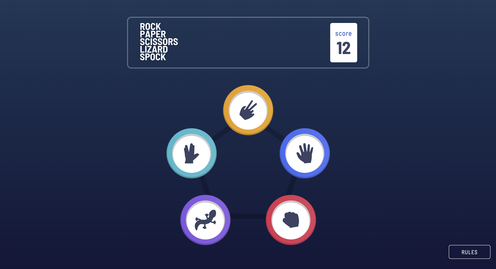

# Frontend Mentor - Rock, Paper, Scissors solution

This is a solution to the [Rock, Paper, Scissors challenge on Frontend Mentor](https://www.frontendmentor.io/challenges/rock-paper-scissors-game-pTgwgvgH). Frontend Mentor challenges help you improve your coding skills by building realistic projects.

## Table of contents

- [Overview](#overview)
    - [The challenge](#the-challenge)
    - [Screenshot](#screenshot)
    - [Links](#links)
- [My process](#my-process)
    - [Built with](#built-with)
    - [What I learned](#what-i-learned)
    - [Continued development](#continued-development)
    - [Useful resources](#useful-resources)
- [Author](#author)

## Overview

### The challenge

Users should be able to:

- View the optimal layout for the game depending on their device's screen size
- Play Rock, Paper, Scissors against the computer
- Maintain the state of the score after refreshing the browser _(optional)_
- **Bonus**: Play Rock, Paper, Scissors, Lizard, Spock against the computer _(optional)_

### Screenshot

### Links

- Solution URL: https://github.com/amjadsh97/rock-paper-scissors
- Live Site URL: https://rock-paper-scissors-tau-fawn.vercel.app/

## My process

### Built with

- Semantic HTML5 markup
- CSS
- Typescript
- [React](https://reactjs.org/) - JS library

### What I Learned
I gained valuable experience in managing game rules and implementing them effectively within the project.

### Continued Development
I’m excited to build on this knowledge by developing a more complex game, which will further challenge my skills and enhance my expertise.

### Useful resources
- [React Docs](https://react.dev/) - This helped me for building react components. I really liked using this docs.

## Author

- Website - [Amjad Shadid](https://amjadshadid.com)
- Frontend Mentor - [@amjadsh97](https://www.frontendmentor.io/profile/amjadsh97)
- Twitter - [@Amjadshadid](https://twitter.com/Amjadshadid)
- Linkedin - [@Amjad Shadid](https://www.linkedin.com/in/amjad-shadid-134355134/)